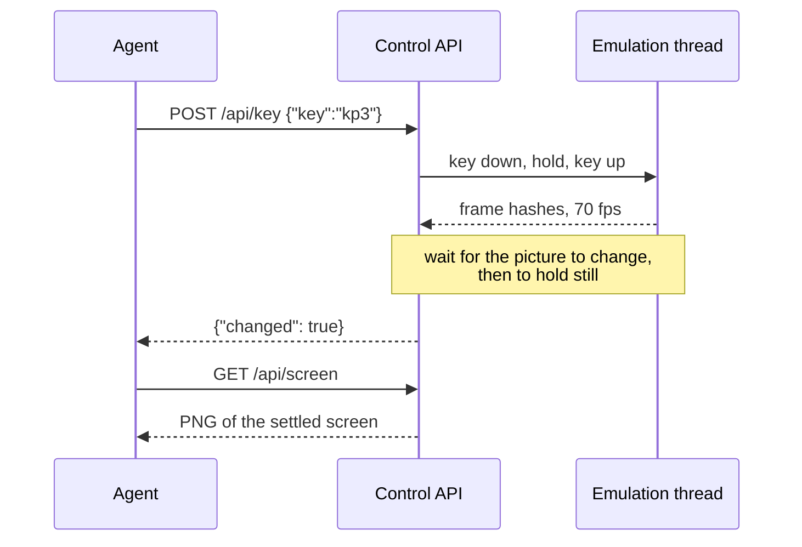
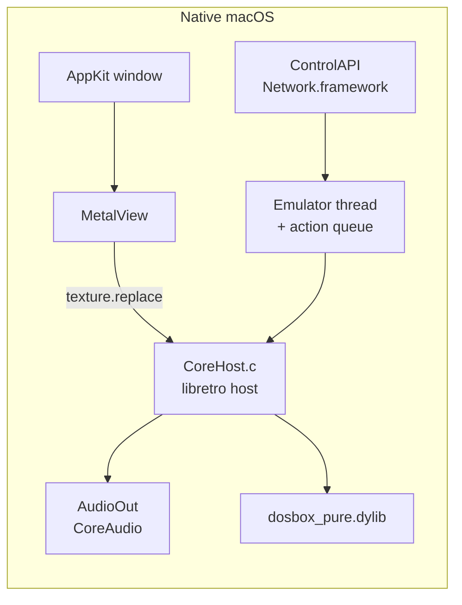
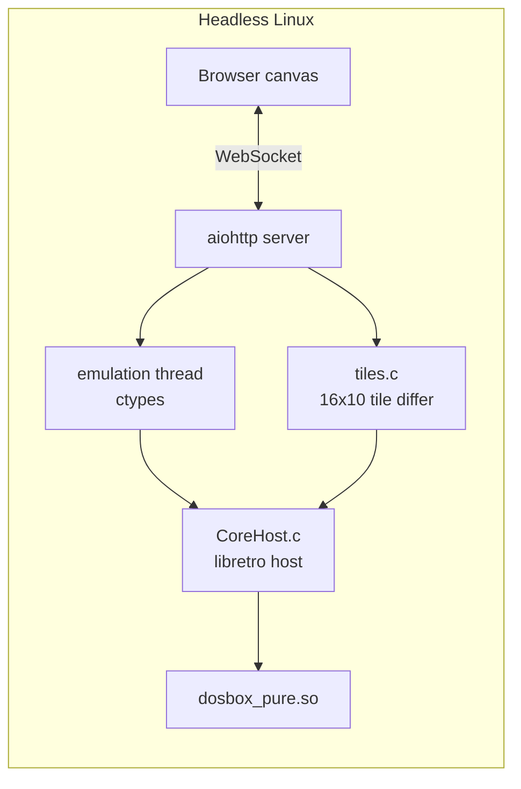

# jy-crpg-bench


A long-horizon benchmark for frontier agents, built on an unmodified 1996 wuxia
CRPG. An agent is given raw 320×200 frames, a key vocabulary, and one page of
objectives, then left to find twelve books in an open world it has never seen.

| | |
|---|---|
| Environment | 金庸群俠傳 (河洛工作室, 1996), DOS, unmodified binary |
| Observation | raw VGA frames, 320×200, Traditional Chinese text |
| Action | 16 keys, isometric movement on four diagonal axes |
| Horizon | open world, no fixed episode length |
| Objective | recover twelve books and return to the present |
| Interfaces | HTTP, MCP, built-in pi harness, browser |
| Runners | native macOS (Metal), headless Linux (browser stream) |


The macOS runner. Metal presents the framebuffer, CoreAudio plays the Sound
Blaster output, and the right pane logs every call to the control API with the
key that was pressed and the screen it returned.


The same game headless on a GCP e2-micro, streamed to a canvas. The activity
panel shows a human and an agent acting on the same session.

## Motivation

Frontier models score well on coding and mathematics while remaining weak at
what a twelve-year-old does without thinking: reading a scene, holding a map in
mind, and pursuing a goal across hours of unfamiliar terrain. Games expose that
gap directly, which is why BALROG evaluates agentic reasoning on reinforcement
learning environments, and VideoGameBench asks vision-language models to
complete 1990s titles from raw pixels alone. Both report frontier models
failing near the beginning of their games.

This environment adds four properties those suites do not combine.

**Long-horizon open world.** A CRPG has no level to clear. Progress comes from
recruiting characters, learning martial arts, and locating twelve books spread
across a large map, so an episode is measured in hours and the reward signal is
whatever the agent can infer from dialogue.

**Reading is the task.** Every objective, refusal and branch is delivered as
Traditional Chinese prose rendered at roughly sixteen pixels a line. Perception
and language comprehension cannot be separated here, and character naming runs
through the 注音 input method, so even starting the game requires understanding
a mechanism rather than pressing a key.

**Isometric spatial reasoning.** The four movement axes are diagonals on
screen, the camera stays centred on the player, and no key moves straight in
any screen direction. An agent that reasons in screen coordinates walks in
circles, which is the dominant observed failure.

**Minimal scaffolding.** The agent receives frames and a key list. There is no
accessibility tree, no game state dump, no reward shaping and no walkthrough.
The briefing in `skills/` teaches the controls and the mechanics that are not
discoverable by pressing keys, and stops there.

Two runners share one control API and one key vocabulary. The game binary is
untouched, DOSBox Pure emulates the PC, and the emulator runs continuously, so
the environment does not pause while a model thinks.

## Running it

```sh
git clone https://github.com/hanxiao/jy-crpg-bench.git
cd jy-crpg-bench
./Scripts/run.sh
```

You supply the game. The 1996 release is copyright its publisher, so it is not
in this repository. Put the original files in `./game`, or build the archive
`run.sh` unpacks with `./Scripts/pack-game.sh` from a copy you own.

```sh
mkdir -p game && cp -R /path/to/jinyong/* game/
```

The DOSBox Pure core is prebuilt in `Cores/`. To rebuild it, clone
`schellingb/dosbox-pure` into `vendor/` and run `make`.

Window keys: arrows and the numpad move, enter and space confirm, esc opens the
menu, y and n answer prompts, and the 注音 name entry works. ⌘1 through ⌘5 set
the scale, ⌘I hides the log pane, ⌘S and ⌘L quick save and load, ⌘M mutes, and
⌃⌘F is fullscreen. The window snaps to whole multiples of 320×200, so the game
is never letterboxed.

For the browser runner, see `server/README.md`.

## Control loop

Acting and looking are separate calls. A key press applies input and waits for
the screen to settle; a screen call returns the picture. An agent acts several
times and looks when it needs to see, which costs one settle per action and one
encode per look.



Waiting for the screen to change before waiting for it to settle is what makes
the returned picture the result of the action. Waiting only for stillness
returns the frame from before the game reacted, and dialogue is drawn with a
typewriter effect that pauses between glyphs, so the settle threshold has to be
generous or lines come back half written.

## Architecture

Both runners load the same libretro core through the same C host. `CoreHost.c`
compiles unchanged on macOS and Linux, so the split is only in presentation.





The browser never receives a video stream. `tiles.c` compares each frame against
the last one sent and emits only the 16×10 tiles that changed, deflated, over
the socket that also carries input. A dialogue update is about 60 tiles and 5 KB,
and an idle screen sends nothing at all.

## Two runners, one key vocabulary

The world is isometric, so the four movement axes are diagonals on screen. The
numpad names match what you see, and are byte-identical to the arrows.

| key | aliases | screen direction |
|---|---|---|
| `kp7` | `left`, `upleft`, `nw` | up-left |
| `kp9` | `up`, `upright`, `ne` | up-right |
| `kp1` | `down`, `downleft`, `sw` | down-left |
| `kp3` | `right`, `downright`, `se` | down-right |

Holding a key walks continuously, so one call with `"hold": 120` covers more
ground than eight taps, at one settle rather than eight. Any key advances
dialogue, not only enter. A script written against one runner works against the
other.

Short taps default to 10 emulated frames. This is long enough to cross a slow
DOS redraw without reaching the game's held-key repeat delay. Callers that need
an exact pulse length can still set `"hold"` explicitly.

## Agent API

The game reads key presses and nothing else. It has no text entry and no mouse,
so every interaction is a key.

```
GET  /screen[?format=png]          look at the screen
GET  /history?limit=100            action log
GET  /keys  /slots  /help
POST /key    {"key":"kp3"}         one key; "times" repeats, "hold" frames
POST /keys   {"keys":["kp9","enter"]}   several in order, "gap" between
POST /wait   {"ms":1000}
POST /save   {"slot":1} | {"name":"before-boss"}
POST /load   {"slot":1}
POST /reset
```

`image` comes back as a base64 PNG data URI. `?format=png` gives raw bytes,
`?image=0` skips the capture, and `?react`, `?stable` and `?maxsettle` tune the
wait. `"changed": false` means the action had no visible effect. `frame` counts
distinct video frames and stalls on a static screen, while `ticks` always rises
while the emulator runs. Boot takes about 14 seconds.

The browser runner exposes the same surface under `/api/`.

## Letting an LLM play

An LLM cannot call an HTTP API on its own, so it needs a harness. There are two
ways to give it one, and both use the same game knowledge.

### Bring your own model, use the built-in harness

`pi-agent/` is a complete harness built on [pi](https://pi.dev). Supply an
OpenAI-compatible endpoint and nothing else.

```sh
npm i -g @earendil-works/pi-coding-agent

export QUNXIA_LLM_BASE_URL=http://localhost:11434/v1
export QUNXIA_LLM_API_KEY=sk-...
export QUNXIA_LLM_MODEL=qwen3-vl:32b
./Scripts/play-agent.sh
```

It starts the game if it is not running, waits for the title screen, and drops
into pi. Add `-p "play the opening"` to run non-interactively.

Everything the agent needs sits in `pi-agent/`, which pi uses as its
configuration directory, so your own `~/.pi` is untouched. `SYSTEM.md` replaces
the coding-agent prompt with the game. `extensions/qunxia/` registers nine
`game_*` tools that apply input, wait for the screen to settle, and return the
frame as an image. The model also keeps the pi `bash`, `read`, `write` and
`edit` tools, and pi compacts context automatically on a long session.

Use a vision model. `QUNXIA_LLM_INPUT='"text"'` drops images for a text-only
model, `QUNXIA_SCALE` changes screenshot size, and `QUNXIA_LLM_CONTEXT` sets the
context window.

### Bring your own harness, take the skill

For an agent that already has a tool loop, `/api/help` returns the whole
briefing as one block of text: `skills/play.{en,zh}.md` for driving the game,
followed by `skills/speedrun.{en,zh}.md`, the field manual covering menus,
combat, attributes, the compass and the traps that cost the most time.
`?part=core` returns only the first half. The browser
runner serves them at `/api/help?lang=en|zh` with its own URL substituted in,
and the page offers them in a copy box. Paste one into a system prompt and the
model has the API, the controls, the isometric axes and the traps.

`skills/jyxzz-speedrun-tips/SKILL.md` is the original research the field manual
came from. Edit that first, then fold anything durable into the served files.

`mcp-server/` wraps the same surface over MCP 2.x for clients that speak it.
Standalone mode loads guidance from the same `skills/` files as `/api/help`. Set
`QUNXIA_MCP_PROFILE=benchmark` to expose only `look`, `press`,
`press_sequence`, and `wait`; benchmark actions return metadata and `look`
returns the native 320x200 frame. Standalone mode keeps the convenience tools.
For benchmark mode, first create a session, then set `QUNXIA_API` to the returned
`base_url` plus `/api`. MCP reads that session's `/api/help` at startup;
`QUNXIA_BENCH_LANG=en|zh` selects the guide language. The client must include the
MCP initialization `instructions` in the model's context: benchmark mode has no
`guide` tool fallback.

## Session recording

Every game is recorded from the moment it starts. A recording is the same tile
deltas the browser stream uses, kept with timestamps and with the key presses
that caused them, so it costs little to keep and nothing extra to produce.
While anyone is acting every frame is kept; once the game has been idle for a
few seconds only the last thirty seconds are retained, which captures the
animation an untouched game plays without growing without end.

The activity panel has a button to replay at 4x, and another to export the
recording as a video with the keys composited into the frame. Encoding happens
in the browser, so a shared instance spends nothing on it.

## Emulated CPU speed

The x86 code is JIT compiled to ARM64 or x86-64 by the DOSBox Pure recompiler,
so there is no interpreter in the hot path. What costs CPU is the cycle budget.
Measured on an M3 Ultra, 10 seconds at the title screen with audio on:

| `dosbox_pure_cycles` | CPU (one core = 100%) | emulated fps | boot to title |
|---|---:|---:|---:|
| `max` | 99.5% | 70.22 | 15.8s |
| `auto` | 81.3% | 70.19 | 19.5s |
| fixed 77000 | 31.3% | 70.17 | 15.9s |
| fixed 26800 | 15.6% | 70.04 | |

The game targets a 486 or Pentium, so anything above a Pentium-100 budget is
spent on its own idle loops. The macOS runner defaults to 77000, and the server
to 26800, which is what lets a shared-core VM hold a full 70.09 fps. Override
with `QUNXIA_SET="dosbox_pure_cycles=max"` or `--set dosbox_pure_cycles=200000`.

## Layout

```
Sources/CoreHost/    libretro host: dlopen, env callbacks, video, audio, input
Sources/QunXia/      Emulator, MetalView, AudioOut, ControlAPI, HistoryView
server/              headless runner: tile differ, aiohttp server, browser client
skills/              play.*.md and speedrun.*.md, served together at /api/help,
                     plus the research they came from
pi-agent/            built-in harness: system prompt and game_* tools
mcp-server/          MCP wrapper
assets/              where your own game-data.tar.gz goes, untracked
Cores/               dosbox_pure_libretro.dylib
saves/               emulator snapshots
```

## Licensing

Three different things live in this repository and they are not under one
licence.

**The code written here** (`Sources/`, `server/`, `mcp-server/`, `pi-agent/`,
`Scripts/`, `skills/`) is MIT, in `LICENSE`.

**DOSBox Pure** (`Cores/dosbox_pure_libretro.dylib`) is GPLv2, built from
`schellingb/dosbox-pure` at `7f6e8fb`. It is loaded at runtime through the
libretro C API and is redistributed here unmodified. Source is available from
upstream.

**The game data** is the 1996 commercial release, copyright 智冠科技 and
河洛工作室. It is not licensed for redistribution and it is not ours to
relicense, so it is not tracked here and you have to supply your own copy.
Earlier commits did carry the archive, so it remains reachable in history;
publishing this repository would require rewriting that history as well.
